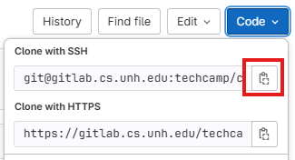

### Outline

* Install tools
* Setup Git and Gitlab
* Create and clone individual project
  - this project will contain all of your individual work for the semester

### Tools and resources

Core tools:

* Python 3.11
* IDE / VSCode
* Git

Resources:

* [SSH Keys in Gitlab](https://gitlab.cs.unh.edu/help/user/ssh.md)
* [Git cheat sheet](https://education.github.com/git-cheat-sheet-education.pdf)

### Setting up Git / Gitlab

configure your username and email

* Open Git bash or your terminal of choice.  
* Use these commands:  

```
  git config --global user.name "John Doe"  
  git config --global user.email johndoe@example.com
```

Generate SSH keys:

* open Git bash or your terminal of choice. 
* input this command:   

```
ssh-keygen -t rsa -b 2048  
```

* you can just press enter at the prompts
* the public keys will be in a file ending in .pub

Add SSH keys to Gitlab

* [Log in to Gitlab](https://gitlab.cs.unh.edu/users/sign_in);   
* Go to User settings
* Go to SSH keys  
* Paste the entire contents of the .pub file from above

### Setting up your project

Create a new project in Gitlab:

  - use the naming convention \<lastname\>-project 
  - do not include '<' and '>' symbols
  - e.g., benedetto-project

Cloning your project:

* get your clone link on Gitlab
  * Click the blue "Code" button on the home page for your project
  * then copy the link to your clipboard



* create a directory for your CS 518 coursework (e.g. "/path/to/cs518").
* go to the directory in the terminal and clone the repo  

```
git clone <url>  
```

* replace \<url\> with the ssh clone link from Gitlab.
* after cloning, there will be a new folder (e.g., "path/to/cs518/my-project" )
* this is the root of your working directory for group work.
